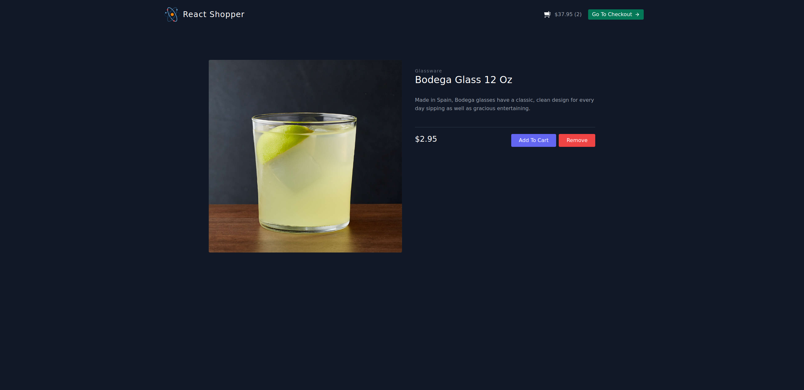
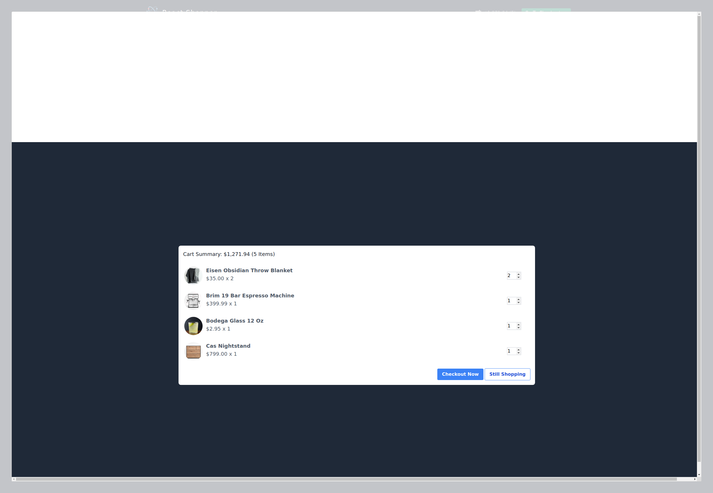
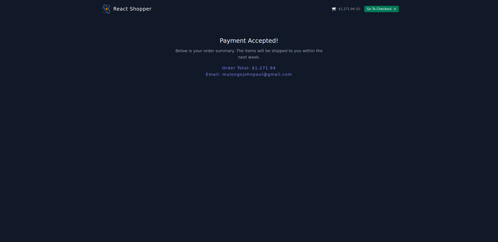

# 

# React Shopper

<table>
<tr>
<td>
  A Shopping Cart App built with React and Node.js. Deployed with Heroku.
</td>
</tr>
</table>

## Demo

Here is a working live demo : https://my-shopper-app.herokuapp.com/

## Site

### Home Page

### Product Page

### Shopping cart

### Payment Feedback Page

## Built with

- [React](https://reactjs.org/)
- [Node.js](https://nodejs.org/en/about/)
- [Stripe](https://stripe.com/) |

## [License]()

MIT © [JP Mulongo](https://github.com/omulosi)
